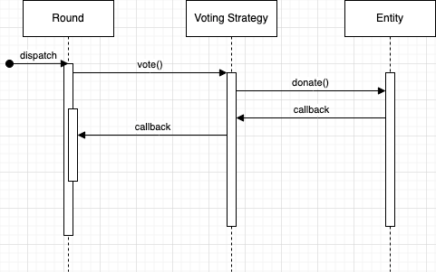

# Endaoment x Gitcoin Allo Donation Voting POC

This is a proof of concept (POC) for a possible integration between
between
[Endaoment](https://github.com/endaoment/endaoment-contracts-v2/tree/main/src/test)
and Gitcoin's [Allo Protocol](https://github.com/allo-protocol/contracts).

## Purpose

The purpose of this repository is to showcase one way in which we could
integrate donation behavior on Endaoment with voting in a quadratic funding
round on Allo Protocol. This would allow Endaoment to leverage it's existing
system and use donations as "votes". 

## Technical Explanation

Allo Protocol distributes funding in Rounds: contracts that hold funding and
distribute it according to a Voting Strategy and a Payout Strategy, where the
Voting Strategy is a contract that decides how the funds should be allocated and
the Payout Strategy is a contract that decides how the funds should be
distributed.

| Module | Description |
| ---  | ---  |
| Voting Strategy  | Contract for deciding **who** receives funding  |
| Payout Strategy  | Contract for deciding **how** they receive funding  |

For an integration with Allo, Endaoment will need to:

- Design and implement an appropriate Voting Strategy
- Use (or design) a Payout Strategy
- Host rounds on the platform

### Hosting a Round on Endaoment

There are a few ways in which we can host rounds on Endaoment.

The first (lightest) way would be to have all Entities within Endaoment be
recipients automatically. Rounds can happen on-demand or on a recurring cadence.
During a round, it would make sense to update the UI to show what the round is,
who provided the matching pool, and the estimated impact of a donation (based on
quadratic matching). This can drive traffic to Endaoment and drive donations.

While this approach is light and would require minimal changes to the UI it does
have a few downsides. Namely, we find that when someone wants to fund a matching
pool, they typically have a specific purpose in mind (like funding groups
working on climate change). A second implementation path is to build out
functionality for organizations on Endaoment to apply for rounds. On their org
detail page in the UI, we could showcase that a round is ongoing and the current
round is a grantee. We can also build out Round detail pages that show what the
round is, what the purpose or intention of the matchings fund is, and who are
the grantees in the round. This would be somewhat akin to running
a Gitcoin-style QF round from within Endaoment.

### Donation Voting

We can design a Voting Strategy that will make it so QF rounds hosted on Allo
sit in front of the existing Endaoment onchain system and don't require making
any changes to it. For that to be the case, the `vote()` method of the Voting
Strategy contract has to just proxy the Entity contracts participating in
a Round:

- If there is an ongoing round and the current org is a grantee, the existing
    `Donate Now` button should (a) approve transfer allowance, then (b) call
    `vote` on the Round contract
- The Round contract invokes `vote()` on the Voting Strategy contract
- `vote()` on the Voting Strategy contract calls `donate` on the appropriate
    Entity contract

## Disclaimer

*These smart contracts are being provided as is. No guarantee, representation or
warranty is being made, express or implied, as to the safety or correctness of
the user interface or the smart contracts. They have not been audited and as
such there can be no assurance they will work as intended, and users may
experience delays, failures, errors, omissions, loss of transmitted information
or loss of funds. The creators are not liable for any of the foregoing. Users
should proceed with caution and use at their own risk.*

See [LICENSE](./LICENSE) for more details.
